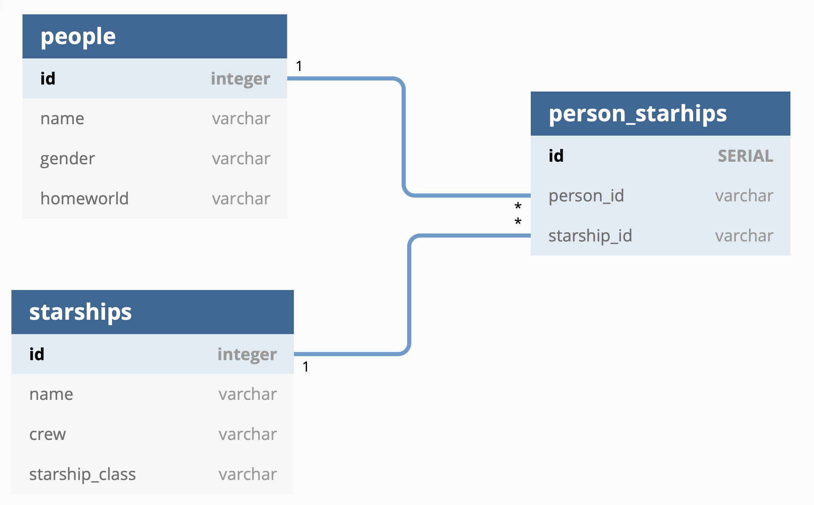
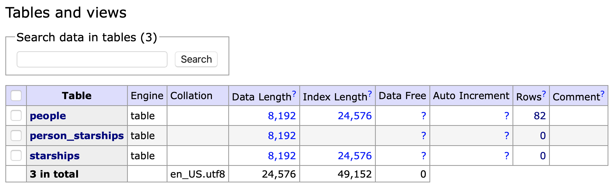
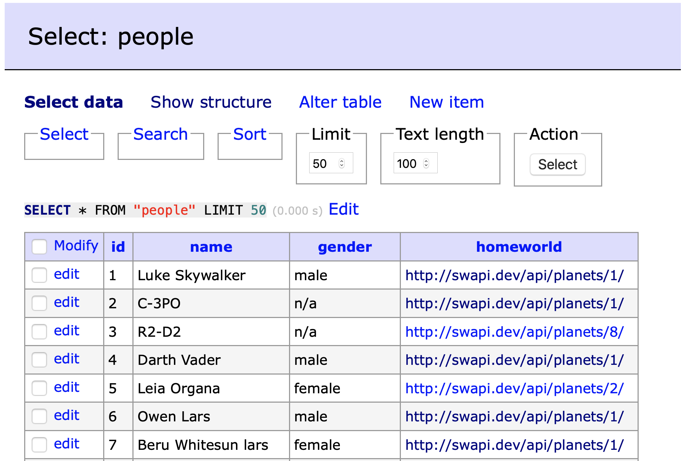
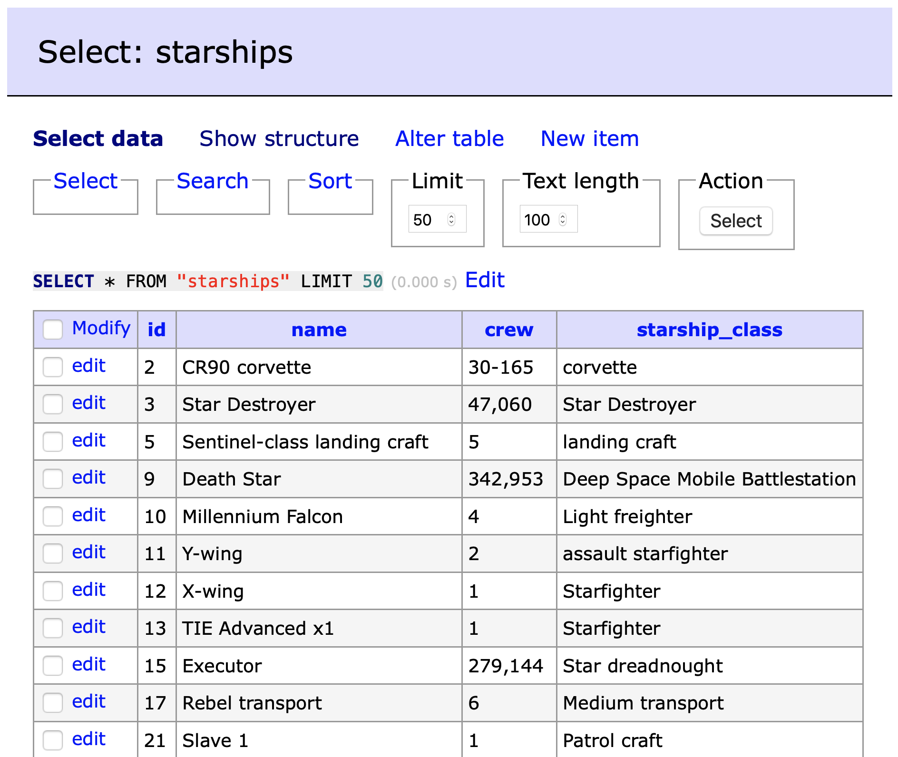
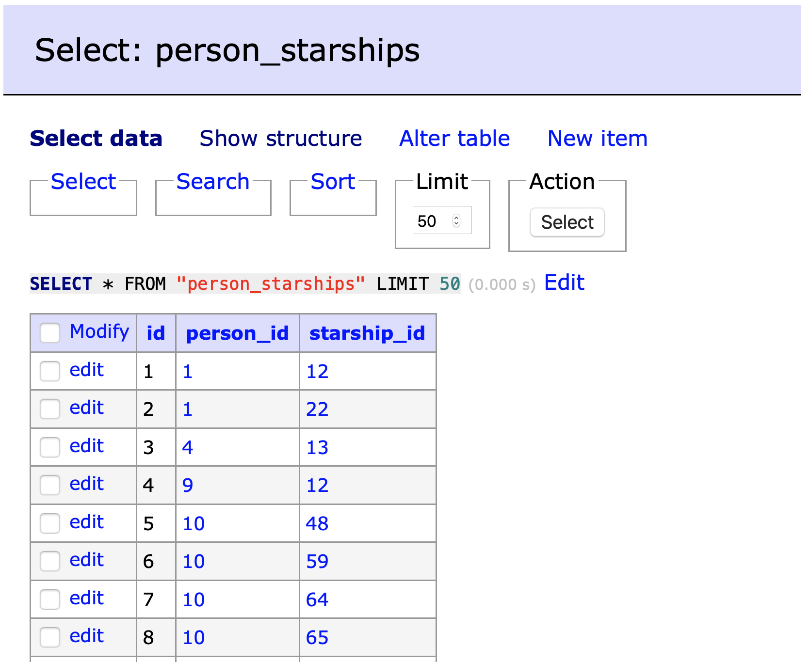

# Star Wars API Data Download

## Setup

- Install Python 3

- Setup python virtual environment from root directory

```bash
# install virtual env
pip install virtualenv

# create virtual environment
virtualenv venv

# activate virtual environment
source ./venv/bin/activate

# install packages
pip install -r requirements.txt
```

- docker / docker-compose is used for running postgres locally
    - [Download docker](https://docs.docker.com/desktop/#download-and-install)


## Running Locally

- Run docker compose from root directory

```bash
docker-compose down && docker-compose up
```

- Activate virtual environment

```bash
source ./venv/bin/activate
```

- Run application from root directory

```bash
python application.py
```

## Decisions
- I used docker and docker compose to run postgres database locally
- I used pip freeze to declare all dependencies in a requirements.txt, instead of installing packages individually
- The relationship between people and starships is many-to-many. There are many ways to design this in a database. I used a junction table. A junction table is more normazlied and provides effecient queries. Another option is to put ids in one of the tables. For example, we can add starship_ids column to the poeple table. However, fetching all people for one starship would be ineffecient, because it would require going through the full people table.

- Database design:




## Verifying Results

"adminer" is a postgres client, and it is setup already inside docker-compose. It can be accessed thorugh [http://localhost:7000](http://localhost:7000)

Use the following credentails:

- User: starwars
- Password: stat
- Database: starwars

After running the application, three tables should be created:



And the three tables should contain data:







## Potential TODOs
- Add unit tests.
- Add remaining columns to the database. For the purpose of simplicity, I used only a few columns for people and starships.
- Move classes into separate modules, instead of having the full code under `applications.py`.
- When fetching from the API, currently all people and starships are loaded in memory, then added to the database. This assumes the data is small. If the data is large, a more effecient solution is needed. For example, a solution would fetch each page and add the info to the database before processing the next page.
- The code deletes all rows at the beginning every time you run it. This is a simple approach, and it assumes the data is small, and it is acceptable that data is not available until the rows are added again. If data is large or data must not be unavailable at any time, a better approach would be to update the database, instead of replacing all rows.
- Use environment variables for urls and database credentials. Putting passwords in github is not secure.
